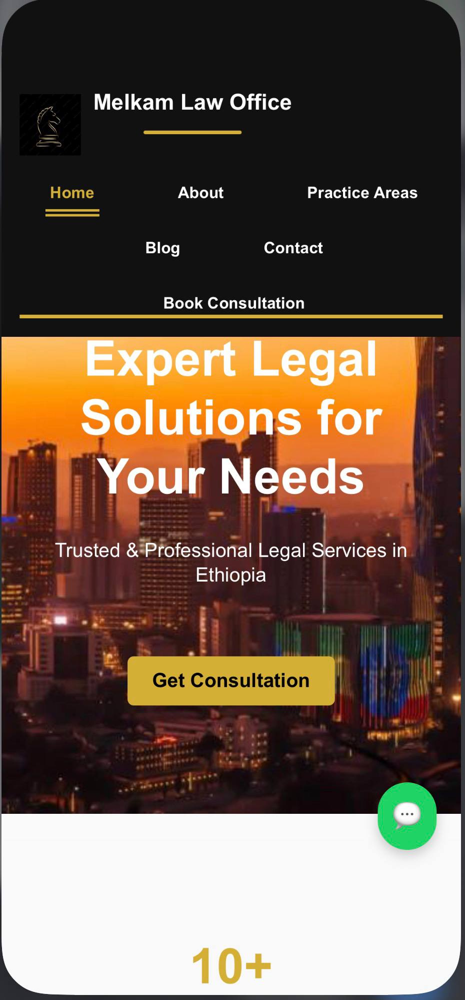
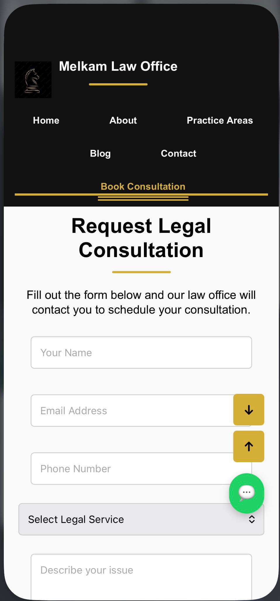
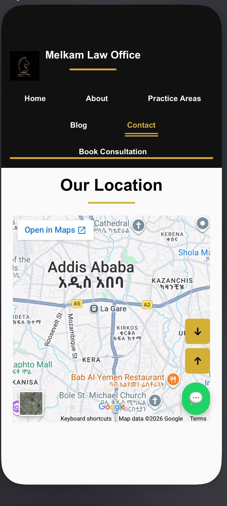

# Lawyer Consultation & Booking Website

A web-based platform designed to help users access legal service information, schedule appointments, and communicate with lawyers online.

## Features

- Browse available legal services
- View lawyer and service information
- Online appointment booking system
- WhatsApp contact integration
- Responsive and user-friendly interface
- Client inquiry management

## Technologies Used

- PHP
- HTML
- CSS
- JavaScript
- MySQL

## Project Status

Currently in development.

## Purpose of the Project

The purpose of this project is to simplify legal consultation access by creating an online platform where users can communicate with lawyers and book appointments easily.

## Future Improvements

- Secure user login system
- Appointment reminders
- Online consultation support
- Admin management panel
- Document upload support

## Author
## Screenshots

### Homepage

### Booking Page

### contact us

Selamawit Mekbib
